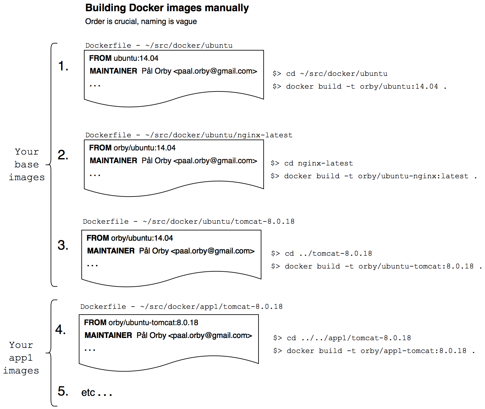

#Docker builder - Dobu

Dobu is short for **Do**cker **bu**ilder

Dobu is a small, lightweight application that will build and tag your Docker images recursively from any Docker image in a layered structure.

---



###Building Docker images with Dobu
```
$> cd ~/src/docker/app1/tomcat-8.0.18
$> dobu build
```

*This will build all parent images and the app1-tomcat:8.0.18 image for you*

All you need for starting using Dobu, is to add a `dobu.yml` beside your Dockerfiles that defines the path to the `parent` and `dockertag` value to use when building the image.

```yaml
// relative path to the parent Dockerfile folder
parent: ../
// the tag to use when executing "docker build -t dockertag path"
dockertag: orby/app1-tomcat:8.0.18
```

Now you can automate your Docker images build procedure, and the best part is that you can start building from the bottom of the chain. Quite the opposite way of what you can do today.
